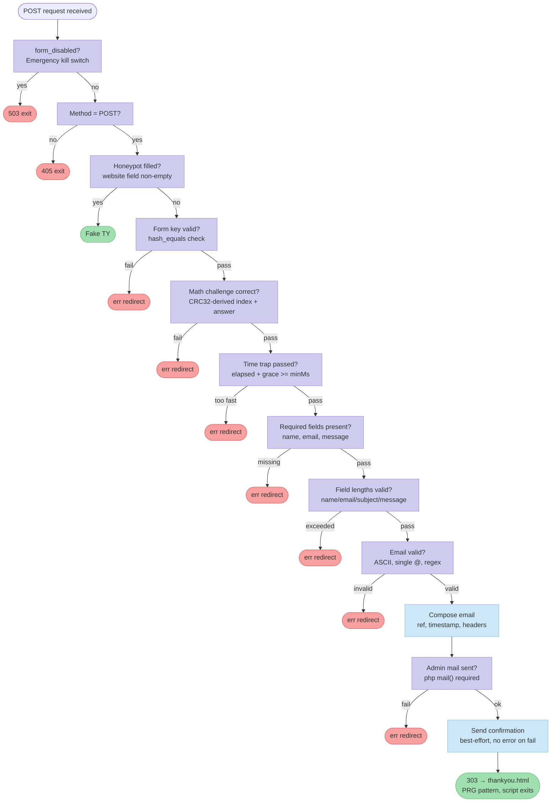

# Form Processing Flowchart

```mermaid
flowchart TD
    A([POST request received]) --> B

    B["form_disabled?\nEmergency kill switch"]
    B -->|yes| C([503 exit])
    B -->|no| D

    D["Method = POST?"]
    D -->|no| E([405 exit])
    D -->|yes| F

    F["Honeypot filled?\nwebsite field non-empty"]
    F -->|yes| G([Fake TY])
    F -->|no| H

    H["Form key valid?\nhash_equals check"]
    H -->|fail| ERR1([err redirect])
    H -->|pass| I

    I["Math challenge correct?\nCRC32-derived index + answer"]
    I -->|fail| ERR2([err redirect])
    I -->|pass| J

    J["Time trap passed?\nelapsed + grace >= minMs"]
    J -->|too fast| ERR3([err redirect])
    J -->|pass| K

    K["Required fields present?\nname, email, message"]
    K -->|missing| ERR4([err redirect])
    K -->|pass| L

    L["Field lengths valid?\nname/email/subject/message"]
    L -->|exceeded| ERR5([err redirect])
    L -->|pass| M

    M["Email valid?\nASCII, single @, regex"]
    M -->|invalid| ERR6([err redirect])
    M -->|valid| N

    N["Compose email\nref, timestamp, headers"]
    N --> O

    O["Admin mail sent?\nphp mail() required"]
    O -->|fail| ERR7([err redirect])
    O -->|ok| P

    P["Send confirmation\nbest-effort, no error on fail"]
    P --> Q

    Q([303 → thankyou.html\nPRG pattern, script exits])

    style C fill:#f8a0a0,stroke:#e07070
    style E fill:#f8a0a0,stroke:#e07070
    style G fill:#a0e0b0,stroke:#70c080
    style ERR1 fill:#f8a0a0,stroke:#e07070
    style ERR2 fill:#f8a0a0,stroke:#e07070
    style ERR3 fill:#f8a0a0,stroke:#e07070
    style ERR4 fill:#f8a0a0,stroke:#e07070
    style ERR5 fill:#f8a0a0,stroke:#e07070
    style ERR6 fill:#f8a0a0,stroke:#e07070
    style ERR7 fill:#f8a0a0,stroke:#e07070
    style Q fill:#a0e0b0,stroke:#70c080
    style B fill:#d0ccf0,stroke:#a090d0
    style D fill:#d0ccf0,stroke:#a090d0
    style F fill:#d0ccf0,stroke:#a090d0
    style H fill:#d0ccf0,stroke:#a090d0
    style I fill:#d0ccf0,stroke:#a090d0
    style J fill:#d0ccf0,stroke:#a090d0
    style K fill:#d0ccf0,stroke:#a090d0
    style L fill:#d0ccf0,stroke:#a090d0
    style M fill:#d0ccf0,stroke:#a090d0
    style N fill:#cce8f8,stroke:#90c0e0
    style O fill:#d0ccf0,stroke:#a090d0
    style P fill:#cce8f8,stroke:#90c0e0
```
